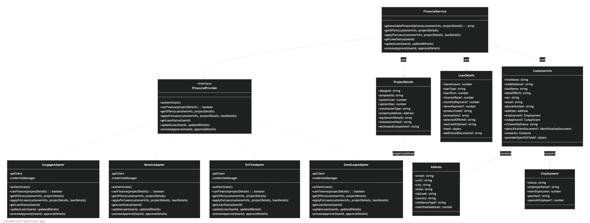
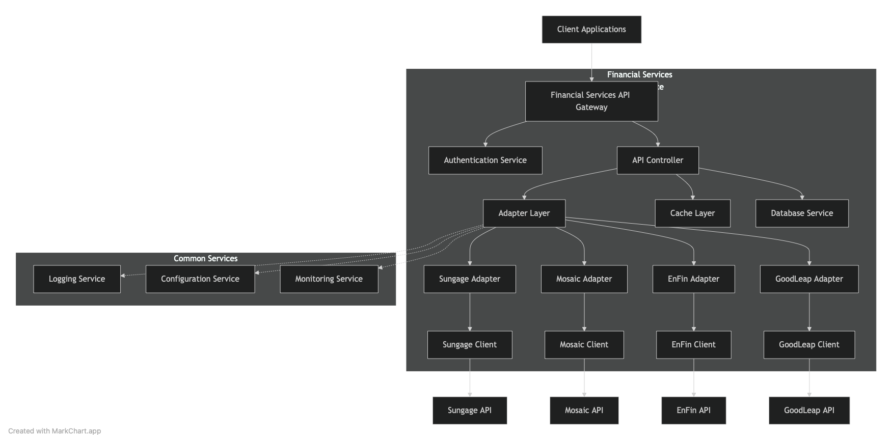

+++
categories= ["AI"]
tags= ["Architecture", "AI", "Claude"]
title= "When using AI tools, don't skip the design."
date = "2025-03-25"
draft=false
comments=true
+++

## Overview

Using AI people fire up their tool of choice and just start building.
This is the wrong approach.  The more you can tell the AI about 'what' you
want to build the higher the success rate will be.

Tell the AI as much as you can about 'what' you want to build and 'how' you
want it to be built.  This is system design.  Very simple applications 'can' be
built without it, but even 'simple' applications can benefit from a design step.


## Use AI for the design step

The good news is that AI tooling can help with the design as well.
The goal of a design step is not to produce code.  It is to produce
design documents.  These design documents will be fed into a different
AI session (or even tool) to build the application.

## Starting a design session

Tell the AI as much as you know about what you want to build.
Does it integrate with third-party api's?  If so provide the 
AI the documentation in the form of a swagger document, pdf, etc..

Provide the AI with this information through the use of a prompt
file, include the goals etc... and tell the AI not to write code.
You are working on the design, not the code.

Once you have the prompt file setup with all the relevant information,
available documentation and the goals, start an AI chat session and 
start asking it to document your design.  Create high level documentation
and diagrams.  These will later be used while you work to implement
the solution.

## A real world example

I'm working with a client that has a number of third party financial
integrations.  These integrations have been builtup overtime and today
they don't have much in common.  Each of them being a bespoke integration
with no common integration layer.  They want to be able to spin up new
integrations faster and allow third parties to plugin to their infrastructure
and provide their own implementations.

### Getting relevant documentation 

I started by getting documentation to all third parties. This presented an
interesting challenge.  These third parties protect their IP behind an 
authentication mechanism.  Well, AI (today) doesn't know how to authenticate.
So you can't just provide it with a documentation url and expect anything 
good to happen.  Additionally, they provide documentation on different
platforms, some use pdf, some swagger while others use custom sites.

#### PDF and Swagger

PDF documents and swagger documents can be understood by most of the 
popular AI tools (I use claude code) and can be referenced directly.

### Other formats

You will have to get creative here.  I ended up writting a program
using puppeteer that would walk the site and generate a pdf document
of the sites content.

### Setting up the prompt

Once I had the documentation extracted I created a CLAUDE.md file
with the provided content. 

```
# CLAUDE.md

This file provides guidance to Claude Code (claude.ai/code) when working with code in this repository.

# TPO Repository

This repository contains documentation for third-party originator (TPO) API integrations for financial services.

## Build/Lint/Test Commands

- No build/lint/test commands are required for this documentation repository

## Code Style Guidelines

- If adding code samples, follow these conventions:
  - JavaScript: Use ES6+, async/await for asynchronous operations
  - Ruby: Follow Rails conventions for SolarNexus integration
  - Use RESTful design patterns for API endpoints
  - Secure all endpoints with JWT authentication
  - Use clear error handling with appropriate HTTP status codes

## Architectural Principles

- Design microservices with clear separation of concerns
- Implement provider-specific adapters behind a unified API
- Make incremental changes rather than sweeping architectural modifications
- Follow OpenAPI/Swagger standards for API documentation

## Integration Notes

- The TPO integrations provide financial services for solar installations
- Follow EnFin API specification versions as documented in PDFs
- Work toward extracting financial services from UI into dedicated microservices

## File information

- ./sungage.json: contains the openapi specification for the Sungage API
- ./mosaic.json: contains the openapi specification for the Mosaic Financing API
- ./EnFin_Loan_API_Document_V13.pdf: contains the PDF documentation for the EnFin Loan API
- ./EnFin_Financing_API_Document_V13.pdf: contains the PDF documentation for the API Financing API
- ./EnFin_Financing_API_Document_V13.pdf: contains the PDF documentation for the API Financing API

```

### Beginning the design session

Start up claude code and ask it "which integrations do you have API information on?".
If everything is setup properly it should give you a response with all of the referenced
documentation in it.

Ask claude "Diagram out a financial services integration with integrations to sungage, mosaic and enfin".
Calude will think for a while and then produce an initial class diagram and component diagram using 
mermaid.  You can iterate on the design simply by conversing with claude.  After iterating for a while
your output should look something like the following.

#### Class Diagram
 

#### Component Diagram


## Conclusion

A well thought out design session will greatly improve your implementation process.
It is important to not skip the design process while implementing a new feature with
AI.  The artifacts from the design session can be added to the CLAUDE.md prompt file
and will greatly improve your success rate when you move on to implementing this solution.

Need expert guidance? Contact ["Fortium Partners"](http://www.fortiumpartners.com/) to help you navigate the vast array of AI tools and integrations, ensuring you select and implement the optimal solution for your unique requirements.


