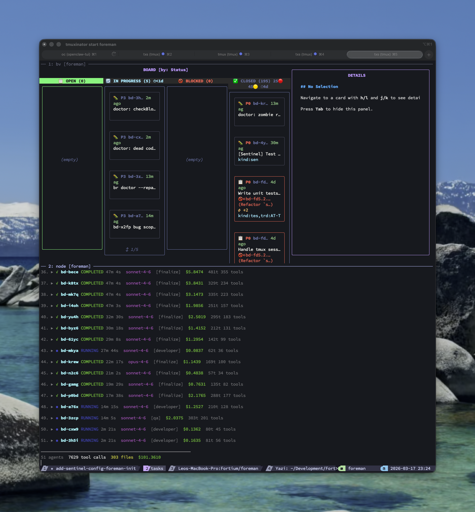
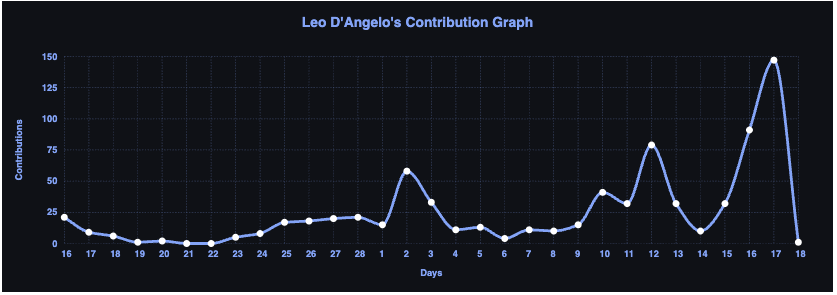

# Foreman: What Happens When You Let 10 AI Agents Loose on Your Codebase

415 commits across 7 repositories. In March. **Alone.**

I'm not grinding through caffeine-fueled all-nighters. I'm sleeping. The commits happen while I sleep — dispatched by **Foreman**, a multi-agent coding orchestrator I built over a single weekend that fundamentally changed how I ship software.

I'm writing this blog post instead of writing code, because the code is writing itself. Let me explain.

## The Problem Nobody Talks About

**AI coding agents are incredible. But you can only run one at a time.**

Try spinning up two Claude Code sessions on the same repo. They'll step on each other's files, create merge conflicts, and generally make a mess. The agent is fast, but it's still sequential. One task, one agent, one branch.

I'm a fractional CTO working across multiple clients. I don't have time to babysit one agent at a time. I needed a way to run 5, 8, even 10 agents simultaneously on the same codebase — each working on a different task, none of them conflicting.

So I built one.

## What Foreman Does

> *"The foreman doesn't write the code — they manage the crew that does."*

Foreman is a multi-agent coding orchestrator. The key building blocks:

- **[Ensemble](https://github.com/FortiumPartners/ensemble)** — our modular Claude Code plugin ecosystem, providing the spec-driven development methodology that feeds Foreman
- **[Beads Rust](https://github.com/steveyegge/beads)** — lightweight task tracking with dependency graphs, no Dolt overhead
- **[Beads Viewer](https://github.com/steveyegge/beads)** — visual kanban for the full dependency graph
- **A custom dispatch loop** — highly tuned prompts that control each Claude Code session's workflow

Here's the pipeline:

```
foreman plan "Build auth system"     # Description → PRD → TRD
foreman sling trd docs/TRD.md       # TRD → task hierarchy
foreman run                          # Dispatch agents to tasks
foreman merge                        # Merge completed work + test
```

The magic is in `foreman run`. It:

1. **Reads the task graph** — understands which tasks are ready (dependencies satisfied) and which are blocked
2. **Spawns agents in isolated git worktrees** — each agent gets its own branch (`foreman/bd-a1b2`), its own working copy, zero possibility of file conflicts
3. **Selects the right model** — Opus for complex refactors, Sonnet for features, Haiku for config tweaks
4. **Monitors progress** — real-time dashboard on `:3850` showing every agent's status, cost, and output
5. **Merges results** — when agents finish, Foreman merges their branches, runs tests, and cleans up

The entire thing is 47,000 lines of TypeScript, 106 test files, and it was built from scratch in about two hours on March 10th. The initial commit at 8:16 AM, the dashboard working by 10 AM.

Yes, Foreman was largely built by AI agents. It's turtles all the way down.

## The Architecture

```
┌─────────────────────────────────────────────────────┐
│               Foreman Dashboard (:3850)              │
│  Projects Overview │ Task Graph │ Agent Monitor      │
└───────────────────────┬─────────────────────────────┘
                        │ REST + WebSocket
┌───────────────────────┴─────────────────────────────┐
│              Foreman Orchestrator                     │
│  Plan → Decompose → Dispatch → Monitor → Merge Queue │
└───────────────────────┬─────────────────────────────┘
         ┌──────────────┼──────────────┐
    ┌────┴────┐    ┌────┴────┐   ┌────┴────┐
    │  Opus   │    │ Sonnet  │   │  Haiku  │
    │ complex │    │ default │   │  light  │
    │worktree │    │worktree │   │worktree │
    └────┬────┘    └────┬────┘   └────┬────┘
         │              │             │
         └──────────────┼─────────────┘
                        ▼
              ┌─────────────────┐
              │   Merge Queue   │
              │─────────────────│
              │ Dependency-order│
              │ merge + test    │
              │ per branch      │
              │                 │
              │ ✓ Pass → main  │
              │ ✗ Fail → flag  │
              └─────────────────┘
```



Each agent runs in complete isolation via a custom dispatch loop — Foreman spawns Claude Code sessions directly with carefully tuned prompts that control the agent's workflow: what files to read, what conventions to follow, how to update task status, and when to stop. They share the same Beads database (symlinked), so they can update their own task status, but their file changes are entirely independent. When an agent finishes, Foreman merges the worktree branch, runs the test suite, and marks the task complete.

If a merge conflicts? Foreman flags it. If tests fail? The branch stays unmerged. No surprises.

## The Commit Graph Tells the Story

Go look at [my GitHub profile](https://github.com/ldangelo). The contribution graph looks like a hockey stick.



For years — 2016 through 2023 — the graph was flat. Not because I wasn't working, but because most of my work was in private client repositories, and the code I did write was at a normal human pace.

Then AI coding agents arrived. The graph started climbing in late 2024. By January 2026, it was consistently green.

And then Foreman happened in March 2026. **84 commits in a single day.** 53 another day. The contribution heatmap for the last month is almost solid dark green.

Here's what a typical Foreman night looks like: I queue up 30-40 tasks before bed. Foreman dispatches agents throughout the night. By morning, I have a stack of completed PRs to review, each one isolated, tested, and ready to merge. Some mornings I wake up to 75 PRs.

The role of the engineer shifts from *writing code* to *reviewing code*. From *implementing* to *governing*. This is the future, and it's already here.

## What I Learned Building It

### 1. Git Worktrees Are the Key

The fundamental insight: git worktrees give you cheap, isolated working copies. Each agent gets one. No conflicts, no coordination overhead, no "please wait while the other agent finishes with that file."

```bash
git worktree add .foreman-worktrees/bd-a1b2 -b foreman/bd-a1b2
```

That's it. The agent has its own sandbox. When it's done, merge or delete.

### 2. Task Decomposition Matters More Than Agent Speed

A fast agent working on a vaguely-defined task will produce vaguely-correct code. A well-decomposed task with clear acceptance criteria, even given to a slower model, produces better results.

This is where [Ensemble's](https://github.com/FortiumPartners/ensemble) spec-driven development methodology pays off. Ensemble takes a product description and runs it through a structured pipeline — PRD → refined PRD → TRD → refined TRD — producing a Technical Requirements Document with well-defined tasks, acceptance criteria, and dependency relationships. Foreman's `sling` command then takes that TRD and breaks it into a hierarchy of Beads tasks, ready for dispatch.

The result: you can go from a product idea to a fleet of agents building it with two commands:

```bash
foreman plan "Build a user auth system with OAuth2"   # Ensemble pipeline → TRD
foreman sling trd docs/TRD.md && foreman run          # TRD → tasks → agents
```

An entire feature — or an entire product — slung to a fleet of agents with a single workflow. The decomposition quality directly determines the output quality, and Ensemble's structured methodology ensures that quality is consistently high.

### 3. Model Selection Is Cost Engineering

Not every task needs Opus. Renaming a variable? Updating a config file? Bumping a version number? That's Haiku territory — 10x cheaper, 5x faster, and more than capable.

Foreman auto-selects based on keywords in the task description:

| Keyword | Model | Why |
|---------|-------|-----|
| `refactor`, `architect`, `migrate` | Opus | Needs deep reasoning |
| Default | Sonnet | Balanced capability |
| `typo`, `config`, `readme` | Haiku | Speed over depth |

This alone cut my API costs by roughly 40%.

### 4. The Merge Queue Is Harder Than the Dispatch

Spawning agents is easy. Merging their work reliably is hard. Foreman went through three iterations of its merge strategy before I got it right:

- **v1**: Merge everything at once. Conflict city.
- **v2**: Merge sequentially, skip conflicts. Better, but lost ordering.
- **v3**: Merge in dependency order, run tests after each merge, halt on failure. This is what ships.

### 5. Observability Changes Everything

Foreman exports OpenTelemetry traces for every agent session. I can see, in Grafana, exactly how long each task took, how many tokens it consumed, and what it cost. This data feeds directly into ROI calculations for clients.

When a CTO asks "what's the ROI on our AI spend?", I can show them a dashboard with cost-per-feature, time-per-task, and agent utilization rates. Try doing that with a human team.

## What This Means for Engineering Leaders

If you're a CTO or VP of Engineering reading this, here's the uncomfortable truth: **your team structure is about to change.**

I've now deployed AI-augmented development across multiple client organizations. The pattern is consistent:

1. **Week 1**: Euphoria. Individual productivity jumps 3-5x.
2. **Week 3**: Bottleneck shifts to code review and architectural governance.
3. **Month 2**: Teams start reorganizing around review and oversight rather than implementation.
4. **Month 3**: Headcount discussions get real.

At one client, we went from a 12-person dev team to 3 — and shipped more features per sprint than the original team. The three remaining engineers are senior architects who review, guide, and make judgment calls. They'll tell you they're doing more interesting work than ever — the tedious implementation grind is gone, replaced by design decisions and quality governance. The AI does the typing.

Foreman accelerates this transition. Instead of one developer with one agent, you have one architect with a fleet. The question isn't "can AI write code?" anymore. It's "how fast can you review it?"

## Try It Yourself

> ⚠️ **Fair warning:** Foreman is in early stages of development and still has some sharp edges — including the lack of a proper installer. It's a daily driver for me, but expect some rough spots if you're picking it up for the first time. Contributions and feedback welcome.

[Foreman](https://github.com/ldangelo/foreman) is built on open tools:

- **[Ensemble](https://github.com/FortiumPartners/ensemble)** — our modular Claude Code plugin ecosystem that provides the foundation: agent skills, workflow patterns, and structured development conventions
- **[Beads Rust](https://github.com/steveyegge/beads)** — lightweight task tracking without the complexity of Dolt, giving you structured dependency-aware work items with minimal overhead
- **[Beads Viewer](https://github.com/steveyegge/beads)** — visualizes the full dependency graph so you can see task relationships, blocked work, and completion progress at a glance
- **[Claude Code](https://docs.anthropic.com/en/docs/claude-code)** as the underlying coding agent
- **A custom dispatch loop** with tuned prompts for workflow control — no framework overhead, just direct agent management

Get started in 30 seconds:

```bash
git clone https://github.com/ldangelo/foreman && cd foreman
npm install
cd ~/your-project
foreman init --name my-project
foreman plan "Build the feature you've been putting off"
```

The concepts are transferable even if you build your own orchestrator. The key ingredients: git worktree isolation, dependency-aware task decomposition, custom workflow prompts, model-appropriate dispatch, and automated merge + test.

The future of software development isn't one developer writing code. It's one leader managing a fleet of agents. Foreman is my proof of concept — and my daily driver.

If you're a technology leader trying to figure out how AI fits into your development organization, [let's talk](https://www.linkedin.com/in/leo-d-angelo-5a0a83). This is what I do at [Fortium Partners](https://fortiumpartners.com).

---

*Leo D'Angelo is a Partner at Fortium Partners, where he serves as fractional CTO for technology companies. He's currently deep in the AI-augmented development space, building tools like Foreman, [Ensemble](https://github.com/FortiumPartners/ensemble), and [Beads Rust](https://github.com/steveyegge/beads) to help engineering organizations adopt AI at scale.*
